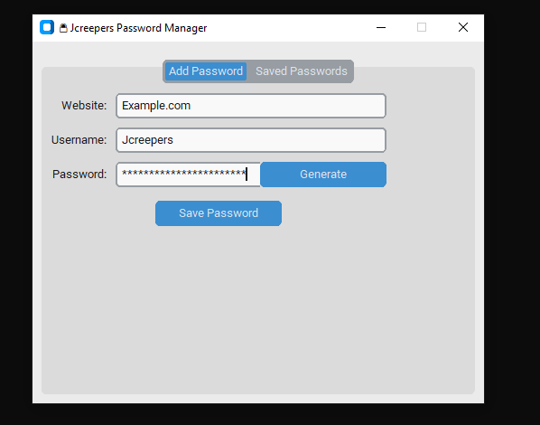

# 🔒 Modern Password Manager

[](https://www.python.org/)
[](https://opensource.org/licenses/MIT)
[](https://github.com/Jcreeper23/Password-Manager)

A **secure, lightweight, and user-friendly Password Manager** built with Python and CustomTkinter.  
Store your passwords **locally on your computer** with **strong encryption** — no data leaves your device.
---
## Features

- 🔐 **AES-128 Encryption via Fernet** — Your data is securely encrypted with a master password.  
- 🖥️ **Modern Flat UI** using CustomTkinter for a clean and intuitive experience.  
- 🎲 **Strong Password Generator** with one-click generation and clipboard copy.  
- 📋 **Clipboard Support** — Easily copy saved passwords with a button click.  
- 🗑️ **Manage Saved Passwords** — View, copy, and delete entries securely.  
- 🛡️ **Local Storage Only** — All passwords are encrypted and saved locally. No internet connection or external servers involved.  
- 📂 **Fully Open Source** — Review or modify the code freely on GitHub.  
---

💻 Screenshots


## Why Trust This Project?

- This password manager is **100% open source**.  
- Your data is encrypted on your machine and **never transmitted or stored online**.  
- The master password is required every time to decrypt your passwords.  
- Error handling prevents unauthorized access with wrong passwords.  
- The codebase is simple and transparent for easy auditing.
---
## Installation & Usage

### Requirements

- Python 3.8 or higher  
- Libraries: `customtkinter`, `cryptography`, `pyperclip`

### Install dependencies

```bash
pip install customtkinter cryptography pyperclip
```
Run the app
```bash
python Password-Manager.py
```

How It Works
On first run, set your master password which encrypts your password storage.
On subsequent runs, enter your master password to unlock saved credentials.
Add new website login info, generate strong passwords, copy them easily, and delete when needed.
All data is saved encrypted locally (passwords.enc) and can only be decrypted with your master password.

Optional: Build Executable
You can create a standalone executable using PyInstaller:
```bash
pip install pyinstaller
pyinstaller --onefile Password_Manager.py
```
License
MIT License — free to use, modify, and distribute.

Contributions & Feedback
Contributions, bug reports, and feature requests are welcome!
Feel free to open issues or pull requests.
